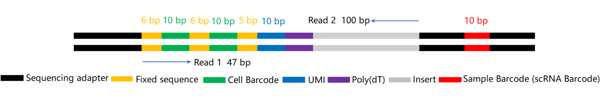
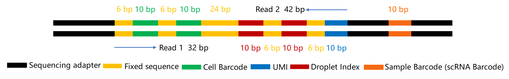

The library structure of the `scRNAv2HT` reagent.

- cDNA：



- oligo：

 

 

A simple demo list below. The name field "cell barcode tag", "cell barcode" and "read 1" are required. In the value filed, `CB` is the tag name for cell barcode and `UR` is the tag name for UMI. In the location field, `R1` is short for read 1, `R2` is for read 2. The cell barcode consists of two segments (`R1:1-10` and `R1:17-26`), first one from 1 to 10 bp of read 1 and the second one from 17 to 26 bp of read 1. And the program will export barcodes and UMI in the name filed of fastq, and base 1 to 100 of read 2 (`R2:1-100`) will be kept in the sequence filed. Predefined white-list is useful to correct barcodes and improve the number of reads per cell barcode. The "distance" and "white list" key in the config file is used to specify the cutoff distance and white-list barcodes. Barcode sequence not found at the white-list will be compared with each known candidate and calculate the hamming distance .

```json
{
    "cell barcode tag":"CB",
    "cell barcode":[
	{
	    "location":"R1:1-10",
            "distance":"1",
            "white list":[
                "TAACAGCCAA",
                "CTAAGAGTCC",
                ...
                "GTCTTCGGCT"
            ]
	},
	{
	    "location":"R1:11-20"
            "distance":"1",
            "white list":[
                "TAACAGCCAA",
                "CTAAGAGTCC",
                ...
                "GTCTTCGGCT"
            ]
	},
    ],
    "UMI tag":"UR",
    "UMI":{
	"location":"R1:21-30",
    },
    "read 1":{
	"location":"R2:1-100",
    }
}
```


A list of support keys in config file shows here.

| key                       | comment                                                      |
| ------------------------- | ------------------------------------------------------------ |
| cell barcode tag          | SAM tag for cell barcode, after corrected. "CB" is suggested. |
| cell barcode              | JSON array for cell barcode segments                         |
| cell barcode raw tag      | SAM tag for raw cell barcode; "CR" is suggested.             |
| cell barcode raw qual tag | SAM tag for cell barcode sequence quality; "CY" is suggested. |
| distance                  | minimal Hamming distance                                     |
| white list                | white list for cell barcodes                                 |
| location                  | location of sequence in read 1 or 2                          |
| sample barcode tag        | SAM tag for sample barcode                                   |
| sample barcode            | SAM tag for sample barcode sequence quality                  |
| UMI tag                   | SAM tag for UMI; "UR" is suggested for raw UMI; "UB" is suggested for corrected UMI |
| UMI qual tag              | SAM tag for UMI sequence quality                             |
| UMI                       | location value for the UMI                                   |
| read 1                    | read 1 location                                              |
| read 2                    | read 2 location                                              |

Positional information when both R1 of cDNA and R1R2 of oligo undergo dark reactions.

```shell
cDNA 
cell barcode:R1:1-10,R1:11-20
umi:R1:21-30
read 1:R2:1-100
oligo
cell barcode:R1:1-10,R1:11-20
read 1:R2:1-30
```

Positional information when R1 of cDNA and R1 of oligo both undergo dark reactions, and R2 of oligo does not undergo dark reaction.

```shell
cDNA 
cell barcode:R1:1-10,R1:11-20
umi:R1:21-30
read 1:R2:1-100
oligo
cell barcode:R1:1-10,R1:11-20
read 1:R2:1-10,R2:17-26,R2:33-42
```
